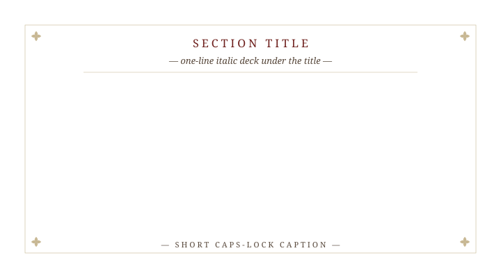

<!--
  BROADSHEET TALK DECK—scaffold

  Structure conventions:
    * Section dividers:  # § N.  Title {.section-divider}
                          + .section-deck (italic one-liner)
                          + .plate (the SVG broadsheet plate)
                          + .plate-caption (italic line under the plate)
    * Content slides:    ## Slide title
                          + .standfirst (optional one-line opener)
                          + the content: math environments (.definition,
                            .theorem, ..., .sketch; .env-row / .fig-row) or
                            .dispatches (content box; .no-bullets to suppress dots)
                          + ::: {.notes} (speaker-only, always)
    * Punch lines (.transition-line, .followup-stamp) are for the hinges only:
      the opener, the turn of a section, the close. A slide that states a
      result ends on the result, not on a slogan; at most one in four slides
      carries a punch line.

  Math: KaTeX. ALWAYS use $\nu$, $\rho$, $\Delta$ etc.—NEVER Unicode ν/ρ/Δ
  in body text (CSS text-transform can upcase Greek lowercase letters).

  Palette:  #6c1d1a oxblood (accent)  ·  #2b211a ink (body)
            #57473a sepia (secondary) ·  #c8b894 parchment (rules/fleurons)
-->


# § I.  Section One {.section-divider}

::: {.section-deck}
*Italic one-liner setting up §I.*
:::

::: {.plate data-plate="I"}

:::

::: {.plate-caption}
*Short caption under the plate—frames what the plate dramatizes.*
:::

::: {.notes}
Section I speaker notes.
:::


## First content slide

::: {.standfirst style="font-size: 0.95em; margin: -0.3rem 0 0.3rem;"}
The standfirst sets up the slide in one tight sentence—the headline claim.
:::

::: {.dispatches .fragment data-title="Dispatch heading" style="font-size: 0.8em; padding: 0.5rem 1.2rem 0.4rem; margin: 0.5rem auto 0.4rem;"}
- **Bullet one**—body of the first point.
- **Bullet two**—body of the second point.
- **Bullet three**—body of the third point.
:::

::: {.transition-line .fragment .fade-up}
*A punch line, for a hinge slide only.* [[☞]{.manicule}Next claim]{.followup-stamp .tilt-a}
:::

::: {.notes}
Slide notes—speaker-only context, the why behind the bullets, citations.
:::


## A math slide

::: {.env-row}
::: {.definition data-num="1" data-name="Name of the notion"}
A definition, set in roman. Inline math $x\in X$ and display math as usual.
:::

::: {.theorem .fragment data-num="1" data-name="Main theorem" data-cite="Author–Author"}
[Hypotheses, set in muted ink.]{.hyp} The conclusion, in italic.

[**Via the key lemma:** one line on what the proof uses.]{.via}
:::
:::

::: {.sketch .fragment}
A proof sketch in two or three sentences; the tombstone is added automatically.
:::

::: {.notes}
State the definition, then the theorem: hypotheses first, then the conclusion. The slide ends on the result; no punch line.
:::


# § II.  Section Two {.section-divider}

::: {.section-deck}
*Italic one-liner setting up §II.*
:::

::: {.plate data-plate="II"}

:::

::: {.plate-caption}
*Short caption under the plate.*
:::


# § III.  Section Three {.section-divider}

::: {.section-deck}
*Italic one-liner setting up §III.*
:::

::: {.plate data-plate="III"}

:::

::: {.plate-caption}
*Short caption under the plate.*
:::


# § IV.  Section Four {.section-divider}

::: {.section-deck}
*Italic one-liner setting up §IV.*
:::

::: {.plate data-plate="IV"}

:::

::: {.plate-caption}
*Short caption under the plate.*
:::


## Thank you {.colophon}

```{=html}
<div class="finis">Q . E . D .</div>
```

::: {.contact}
[paper](https://arxiv.org/abs/0000.00000) · [site](https://example.com) · [email](mailto:author@example.com)
:::

::: {.subscription}
*With thanks to* Collaborator A, Collaborator B. Venue · DD Month YYYY.
:::
