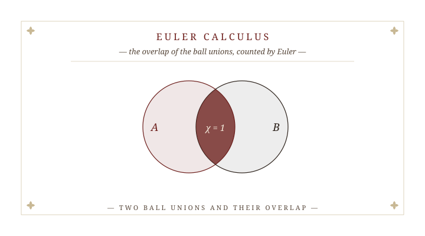
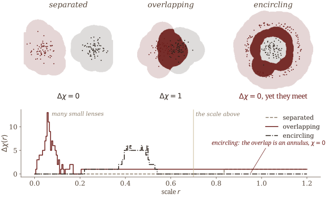
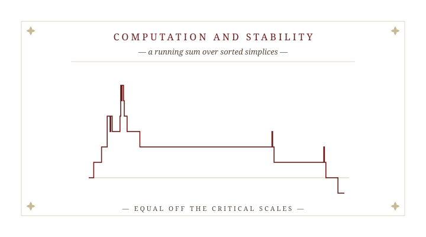
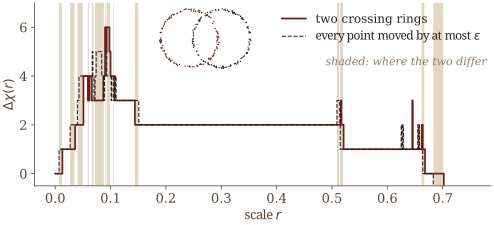
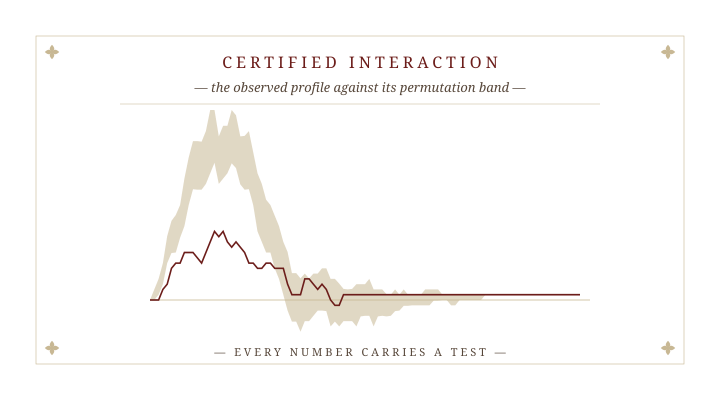
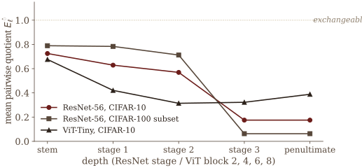
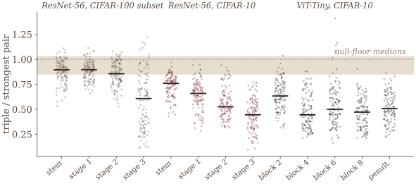

## How much do they interact?

::: {.opener-quote}
Several point clouds in $\mathbb R^d$: species occurrences, cell types, sensor tracks.

How much do they interact **topologically**, and **at what scale**?
:::

::: {.env-row}
::: {.rmk .fragment data-name="One cloud at a time"}
The barcode of $X$ is blind to $Y$: it is the same wherever $Y$ sits.
:::

::: {.rmk .fragment data-name="All clouds at once"}
The barcode of $X\cup Y$ reacts to where they sit while they are still apart: a bar of $H_0$ dies at half their distance.
:::
:::

::: {.aside-note .fragment}
What we want is the topology of the **overlap**, scale by scale.
:::

::: {.notes}
Thank you. The question is simple to state. We have several point clouds in the same space: where species occur, where cell types sit in an expression space, tracks of sensors. How much do they interact topologically, and at what scale?

[click] Persistence answers a different question. The barcode of one cloud is blind to the others; move Y anywhere and the barcode of X does not change.

[click] The barcode of the union does see Y, but too early: it reacts to the relative position while the clouds are still apart. A bar in degree zero dies at half their distance, whether or not they ever overlap.

[click] What we want is the topology of the overlap itself, as a function of the scale.
:::


# § I.  Euler Calculus {.section-divider}

::: {.plate data-plate="I"}

:::

::: {.notes}
Section one: the definition, three examples, and why this curve and not another.
:::


## The profile

::: {.env-row}
::: {.definition data-num="1" data-name="Intersection ECP"}
For pairwise disjoint finite clouds $\mathcal X=(X_1,\dots,X_k)$ in $\mathbb R^d$, with $\mathcal U(X;t)=\bigcup_{p\in X}B(p,t)$, and scales $\mathbf t\in\mathbb R^k_{\ge0}$,
$$
\Delta\chi(\mathbf t;\mathcal X)\;=\;\int_{\mathbb R^d}\prod_{i=1}^k \mathbf 1_{\mathcal U(X_i;t_i)}\,d\chi .
$$
:::

::: {.theorem .fragment data-num="1" data-name="Intersection theorem" data-cite="Kawamura–Majhi–Mitra"}
$$
\Delta\chi(\mathbf t;\mathcal X)\;=\;\chi\Big(\bigcap_{i=1}^k\mathcal U(X_i;t_i)\Big).
$$
On the diagonal, for two clouds, $\Delta\chi(r)=\chi_X(r)+\chi_Y(r)-\chi_{X\cup Y}(r)$.
:::
:::

::: {.aside-note .fragment}
An integer-valued curve, not a diagram: it enters a test or a learning pipeline as it is, with no vectorization.
:::

::: {.notes}
The definition. Take the ball union of each cloud at its own scale, multiply the indicator functions, and integrate against the Euler characteristic. Euler calculus.

[click] The integral of a product of indicators is the Euler characteristic of the intersection. So the profile is the Euler characteristic of the overlap of the clouds' ball unions. On the diagonal, for two clouds, inclusion and exclusion give three Euler characteristic curves: X, Y, and the pooled cloud.

[click] It is an integer-valued curve. A test or a classifier can take it as it is; nothing has to be vectorized.
:::


## Three configurations

::: {.example data-num="1" data-name="Separated, overlapping, encircling"}
At the marked scale the overlap is empty, one lens, and an annulus: $\Delta\chi=0,\ 1,\ 0$. The encircling clouds **meet**, yet $\chi$ of an annulus is $0$.
:::

::: {.fig-wide style="width: 69%; margin: 0.1rem auto 0;"}

:::

::: {.notes}
Three configurations, computed. Separated: nothing until the unions touch. Overlapping: one overlap region, and the profile is one, after a burst of small lenses at tiny scales. Encircling: a ring around a blob. At the marked scale they meet, but the overlap is an annulus, whose Euler characteristic is zero.

That is the blind spot of any Euler-characteristic invariant, and we do not hide it: the test of section three carries a guard for it, the first scale at which the unions provably meet.
:::


## Why this curve

::: {.theorem data-num="2" data-name="Universality" data-cite="Kawamura–Majhi–Mitra"}
[Let $\Phi$ assign to each $\mathcal X$ an integer profile, with]{.hyp}

- **pointwise Euler form:** $\Phi(\mathcal X)(\mathbf t)=\int\varphi\big(\mathbf 1_{\mathcal U(X_1;t_1)},\dots,\mathbf 1_{\mathcal U(X_k;t_k)}\big)\,d\chi$ for some $\varphi:\mathbb Z^k\to\mathbb Z$, $\varphi(\mathbf 0)=0$;
- **separation:** $\Phi(\mathcal X)(\mathbf t)=0$ when the $k$-fold overlap is empty;
- **normalization:** $\Phi(\mathcal X)(\mathbf t)=1$ when the overlap is a single lens $\bigcap_i B(x_i,t_i)$.

Then $\Phi=\Delta\chi$.
:::

::: {.rmk .fragment data-name="What it says, and what it does not"}
It decides **which** Euler-level summary of the overlap, not that its value measures strength: $\chi$ is signed and not monotone. A stronger form asks only for a valuation, homotopy invariance, separation and normalization.
:::

::: {.notes}
Why this curve and not another Euler integral. Suppose an assignment is an Euler integral of some pointwise function of the indicators, registers nothing when the clouds have no common overlap, and gives one on a single lens. Then it is the intersection profile. Separation and normalization force it.

[click] What this does not say: that a bigger value means a stronger interaction. The Euler characteristic is signed and not monotone. Universality picks the summary; deciding whether clouds interact is the job of the tests. There is a stronger version in the paper, assuming only a valuation, homotopy invariance and the same two axioms.
:::


# § II.  Computation and Stability {.section-divider}

::: {.plate data-plate="II"}

:::

::: {.notes}
Section two: what it costs, and how it moves when the data move.
:::


## Computation

::: {.theorem data-num="3" data-name="Complexity" data-cite="Kawamura–Majhi–Mitra"}
For $|X|+|Y|=n$ in fixed dimension $d$, sweeping the Alpha complexes of $X$, $Y$ and $X\cup Y$ in birth order computes $\Delta\chi$ in $O\big(n^{\lceil d/2\rceil}\log n\big)$ time and $O\big(n^{\lceil d/2\rceil}\big)$ space, forming no boundary matrix.
:::

::: {.env-row}
::: {.rmk .fragment data-name="The sweep"}
Each Euler characteristic curve is a running sum $\sum_{a(\sigma)\le r}(-1)^{\dim\sigma}$ over simplices sorted by birth. No persistence reduction.
:::

::: {.rmk .fragment data-name="Optimal, and beyond two"}
Worst-case optimal in even $d$ among algorithms that build the filtration. $k$ clouds by inclusion–exclusion, $O\big(2^k n^{\lceil d/2\rceil}\log n\big)$; off the diagonal, a weighted Alpha complex.
:::
:::

::: {.notes}
The cost. Three Alpha complexes, of X, of Y and of the pooled cloud. Sort each by birth scale, and the Euler characteristic curve is a running sum of signs. No boundary matrix, no reduction.

[click] That is n to the ceiling of d over 2, times log n, the size of the Alpha complex.

[click] In even dimension it is worst-case optimal among algorithms that build the filtration. For k clouds, inclusion and exclusion over the subsets; off the diagonal, with a different scale per cloud, a weighted Alpha complex does the same job.
:::


## Stability

::: {.theorem data-num="4" data-name="Stability" data-cite="Kawamura–Majhi–Mitra"}
[Let $\epsilon=\max_i d_H(X_i,X_i')$.]{.hyp} The overlap filtrations of $\mathcal X$ and $\mathcal X'$ are $\epsilon$-interleaved; $\Delta\chi(r)=\Delta\chi'(r)$ whenever $[r-\epsilon,r+\epsilon]$ holds no critical scale of either; and $\|\Delta\chi-\Delta\chi'\|_{L^1}\le2\epsilon\,(N+N')$, with $N,N'$ the numbers of bars.
:::

::: {.fig-wide .fragment style="width: 66%; margin: 0.15rem auto 0;"}

:::

::: {.rmk .fragment data-name="The honest form"}
$\Delta\chi$ itself admits no interleaving distance, and no $L^1$ bound free of the bar count can hold.
:::

::: {.notes}
Stability, stated as it is proved. Move every point by at most epsilon. The overlap filtrations are epsilon-interleaved, so their persistence modules are; the profile is exactly equal away from the critical scales; and its L1 distance is bounded by epsilon times the numbers of bars.

[click] In the picture, two crossing rings and a perturbation: the curves coincide except near the scales where something happens. The long plateau at two is the two lenses where the rings cross.

[click] And the honest form: the profile itself carries no interleaving distance, and the bar count in the L1 bound cannot be removed. Integer-valued means that close becomes equal, away from the critical scales.
:::


## Consistency

::: {.theorem data-num="5" data-name="Consistency" data-cite="Kawamura–Majhi–Mitra"}
[Let $A_1,\dots,A_k\subset\mathbb R^d$ be compact with reach at least $\tau>0$, sampled i.i.d. from measures positive on balls, and let $r\in(0,\tau)$ be a regular scale of $\rho\mapsto T_\rho=\bigcap_i\mathcal U(A_i;\rho)$.]{.hyp} Then almost surely, for all large samples, the $\epsilon$-persistent Euler characteristic of the sample overlap equals $\chi(T_r)$; and if $r$ is also regular for the sample, $\Delta\chi(r;X_1,\dots,X_k)=\chi(T_r)$ **exactly**.
:::

::: {.rmk .fragment data-name="How many samples"}
$O\big(\epsilon^{-k_i}\log(1/\delta)\big)$ points from $A_i$, in its **intrinsic** dimension $k_i$, not the ambient $d$.
:::

::: {.notes}
Consistency. If the clouds are samples from compact sets of positive reach, then for large samples the profile recovers the Euler characteristic of the population overlap, persistently in general, and exactly at scales that are regular for both.

[click] The sample size depends on the intrinsic dimension of each set, as in Niyogi, Smale and Weinberger.
:::


# § III.  Certified Interaction {.section-divider}

::: {.plate data-plate="III"}

:::

::: {.notes}
Section three: every number carries a test, and two applications.
:::


## Every number carries a test

::: {.env-row}
::: {.definition data-num="2" data-name="Interaction quotient"}
With $\Phi(\Delta\chi)=\int|\Delta\chi(r)|\,dr$,
$$
\widehat E=\frac{\Phi\big(\Delta\chi(\cdot;X_1,\dots,X_k)\big)}{\mathbb E_{H_0}\,\Phi}\,,
$$
about $1$ when the labels are exchangeable, tending to $0$ under separation.
:::

::: {.proposition .fragment data-num="1" data-name="Exact tests" data-cite="Majhi"}
[If the labels of the pooled sample are exchangeable,]{.hyp} the two one-sided permutation $p$-values satisfy $\Pr[p\le\alpha]\le\alpha$ for every statistic, every $\alpha$, every sample size and every number $B$ of permutations.
:::
:::

::: {.env-row}
::: {.rmk .fragment data-name="A guard for the blind spot"}
A separation certificate also checks that the unions provably meet, from the first interaction scale $r^\ast$; without it, an annular overlap is certified as separated.
:::

::: {.rmk .fragment data-name="Comparisons"}
A paired sign-flip test for claims such as *layer $\ell+1$ is more disentangled than layer $\ell$*. The statistic must be **scale-free**.
:::
:::

::: {.notes}
The inferential layer. The interaction quotient: the profile's mass, divided by its mean under relabeling. About one when the labels are exchangeable, near zero when the clouds are separated.

[click] Relabel the pooled sample, recompute, compare. Both one-sided tests are exact: valid at every level, for every sample size and every number of permutations.

[click] The guard: the encircling example would read as separated, because its profile vanishes. So a separation certificate also checks the first scale at which the unions provably meet.

[click] For comparisons, a paired sign-flip test. One lesson from building it: the statistic must be scale-free. On the raw mass, which has units of length, training dynamics of the feature norm masquerade as disentanglement.
:::


## Monsoon onset

::: {.standfirst .math}
A four-signal onset detector: the profile between the delay-embedded windows before and after each day, with complexity variance, Higuchi fractal dimension and a rolling mean. Delete the profile and test the paired change in error.
:::

::: {.methods .fragment}
| onset | system | years | with | without | $\Delta$MAE, days (95% CI) | $p$ |
|:--|:--|:-:|:-:|:-:|:-:|:-:|
| sharp | Nepal | 48 | 9.27 | 9.38 | $-0.10$ $[-1.48,\,1.21]$ | 0.905 |
| sharp | Kerala | 45 | 6.18 | 7.02 | $-0.84$ $[-2.07,\,0.38]$ | 0.200 |
| gradual | Western North Pacific | 66 | 17.36 | 20.39 | $\mathbf{-3.03}$ $[-4.89,\,-1.15]$ | **0.003** |
| gradual | Australian | 61 | 16.52 | 20.18 | $\mathbf{-3.66}$ $[-5.13,\,-2.21]$ | **< 0.001** |
:::

::: {.aside-note .fragment}
It helps where onset is gradual and the signal-to-noise ratio is low, and only there. Paired sign-flip randomization test, $10^5$ sign assignments. With Atish Mitra, Santanu Nandi, Md Nurujjaman and Buddha Nath Sharma.
:::

::: {.notes}
An application where the answer is mixed, and that is the point. Monsoon onset from daily rainfall: four signals, one of them the profile between the windows before and after each day, delay-embedded. To see what the topology contributes, delete it and test the paired change in error across years.

[click] On the two Indian targets, where onset is sharp, deleting it changes nothing that survives the test. On the Western North Pacific and the Australian monsoons, where onset is gradual and noisy, deleting it costs three to three and a half days.

[click] So: it helps in the low signal-to-noise regime, and only there. The test is a paired sign-flip randomization test. The Western North Pacific effect is negative under all eighty onset definitions we tried and significant in sixty-five; the Australian is significant in all eighty. Joint work with Atish, Santanu Nandi, Md Nurujjaman and Buddha Nath Sharma.
:::


## Disentanglement, certified

::: {.standfirst .math}
Class-conditional clouds of $111$ trained networks: $1{,}170$ (network, layer, checkpoint) cells, $52{,}650$ certified pairwise measurements.
:::

::: {.fig-row}
::: {.fig style="flex-basis: 56%;"}

:::

::: {.stmts}
::: {.rmk .fragment data-name="Depth-graded"}
The mean pairwise quotient falls with depth: $0.72\to0.63\to0.57\to0.18$ on ResNet-56, CIFAR-10.
:::

::: {.rmk .fragment data-name="Early, step by step"}
$12{,}375$ paired tests between consecutive checkpoints: $2{,}707$ significant steps, $2{,}026$ of them decreases, $1{,}728$ within the first $8$ epochs.
:::
:::
:::

::: {.notes}
Second application: when does a classifier pull its classes apart? Take the class-conditional point clouds at each layer and checkpoint of 111 trained networks. Every pairwise number is a certified measurement.

[click] Disentanglement is graded by depth: the quotient falls stage by stage, and the deep stage is far from the null. The ViT turns at its middle block.

[click] Over training, paired sign-flip tests between consecutive checkpoints, corrected for multiple testing: two thousand seven hundred significant steps, three quarters of them decreases, most in the first eight epochs. This is where the scale-free statistic matters: on the raw mass, every first-epoch step points the wrong way.
:::


## Mostly pairwise

::: {.definition data-num="3" data-name="Triple versus strongest pair"}
For classes $c,c',c''$ at layer $\ell$: $\ \rho_\ell=\widehat E_\ell(c,c',c'')\,\big/\,\max\big\{\widehat E_\ell(c,c'),\widehat E_\ell(c,c''),\widehat E_\ell(c',c'')\big\}$. Only a $k$-fold profile can pose it.
:::

::: {.fig-wide .fragment style="width: 76%; margin: 0.1rem auto 0;"}

:::

::: {.aside-note .fragment}
$\rho\le1$ in $1{,}509$ of $1{,}560$ cells ($96.7\%$), median $0.63$. An unstructured null already reaches $83\%$; the evidence is the medians, $0.44$–$0.89$ against $0.85$–$1.03$ ($p=3.3\times10^{-8}$). A regularity, not a law.
:::

::: {.notes}
A structural question only a k-fold statistic can ask: is a triple of classes more entangled than its most entangled pair?

[click] Every triple of classes, at every layer of the three architectures: the ratio of the triple's quotient to its strongest pair's.

[click] At or below one in ninety-seven percent of the cells, median 0.63. But be careful with the ninety-seven: an unstructured null already scores eighty-three. The evidence is in the medians: every cell median against the null medians, an exact one-sided Mann–Whitney test, p of three in a hundred million. In the deep layers, 597 of 600, median 0.47. And it is a regularity, not a law: an adversarial search finds configurations with ratio near two.
:::


## What remains

::: {.question data-num="1" data-name="Whether, not how much"}
$\chi$ is signed and blind on annuli. The relative-homology refinement of the paper is stable in the interleaving distance; can a test use it directly?
:::

::: {.question .fragment data-num="2" data-name="Off the diagonal"}
A different scale per cloud: what does the multiparameter profile certify that the diagonal cannot?
:::

::: {.rmk .fragment data-name="Next"}
- *Statistical Inference for Topological Interaction*, with Kazuhiro Kawamura, Atish Mitra and [Pramita Bagchi]{.name-hl}.
- *Reconstruction of Transversal Intersections from Separate Samples*, with Kazuhiro Kawamura.
:::

::: {.notes}
What remains. The Euler characteristic is signed and blind on annuli. The paper has a relative-homology refinement that is stable in the interleaving distance; the question is a test built on it.

[click] Off the diagonal, each cloud at its own scale: what does the multiparameter profile certify that the diagonal cannot?

[click] Two pieces of work in progress: the statistics of topological interaction, with Kazuhiro, Atish and Pramita Bagchi; and reconstructing a transversal intersection from separate samples, with Kazuhiro.

Thank you.
:::


## Thank you {.colophon}

```{=html}
<div class="finis">Q . E . D .</div>
```

::: {.contact}
[arXiv:2608.06180](https://arxiv.org/abs/2608.06180) · [arXiv:2609.08561](https://arxiv.org/abs/2609.08561) · [arXiv:2604.15262](https://arxiv.org/abs/2604.15262) · [smajhi.com](https://smajhi.com) · [s.majhi@gwu.edu](mailto:s.majhi@gwu.edu)
:::

::: {.subscription}
*Joint work with* Kazuhiro Kawamura and Atish Mitra. SIAM Conference on Mathematics of Data Science · Salt Lake City · 16 November 2026.
:::
